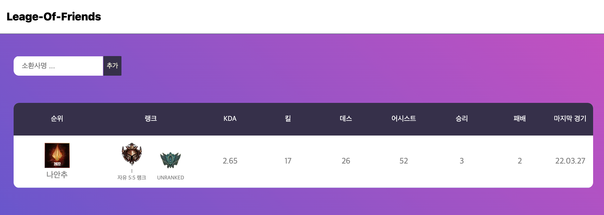

# League Of Friends

### DESCRIPTION

League Of Friends is a website that presents data that can provoke a competitive spirit with friends.
Adds you and your friend's Summoners to the list and ranks them based on Kill, Death, and Assist.
Ranking is displayed based on data from the last 5 matches. In addition, it also shows rank, victory, and defeat data.

<br />

## Demo
- [leage-of-friends](https://league-of-friends.vercel.app/)



<br />

## DEV


install dependencies
~~~
npm run install
~~~

running develop
~~~
npm run dev
~~~

running production
~~~
npm run build
npm run start
~~~

<br />

### dependencies

```json
"dependencies": {
  "axios": "^0.21.1",
  "next": "^12.1.0",
  "react": "17.0.2",
  "react-dom": "17.0.2",
  "swr": "^1.2.2"
},
"devDependencies": {
  "@types/node": "^17.0.18",
  "@types/react": "17.0.19",
  "eslint": "7.32.0",
  "eslint-config-next": "11.1.0",
  "typescript": "4.4.2"
}
```

<br />
